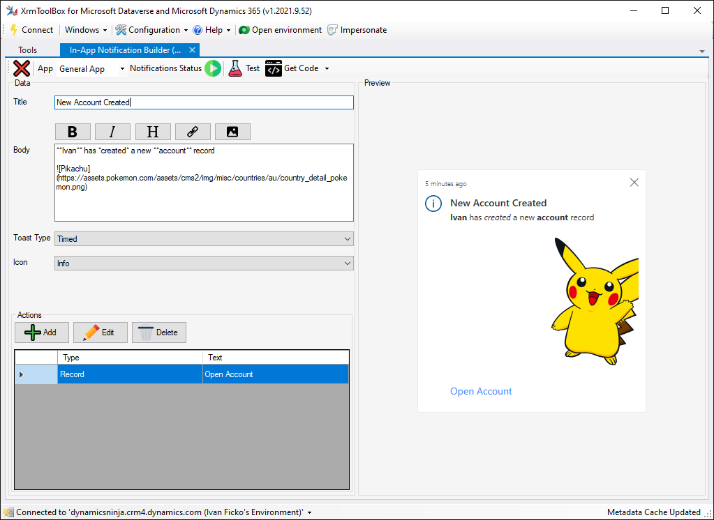
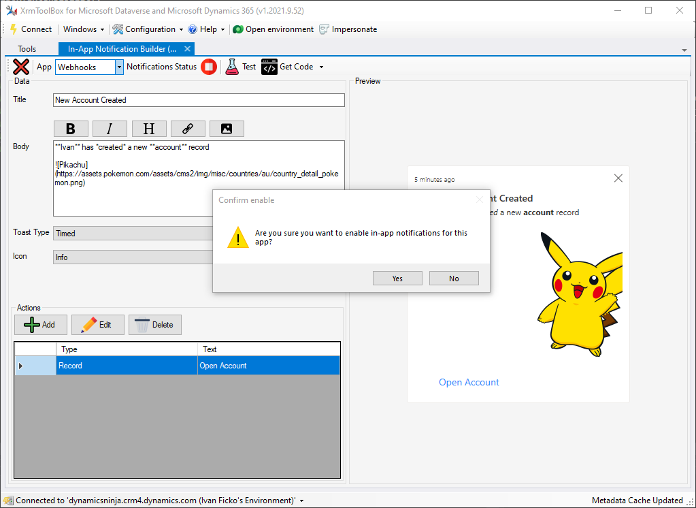
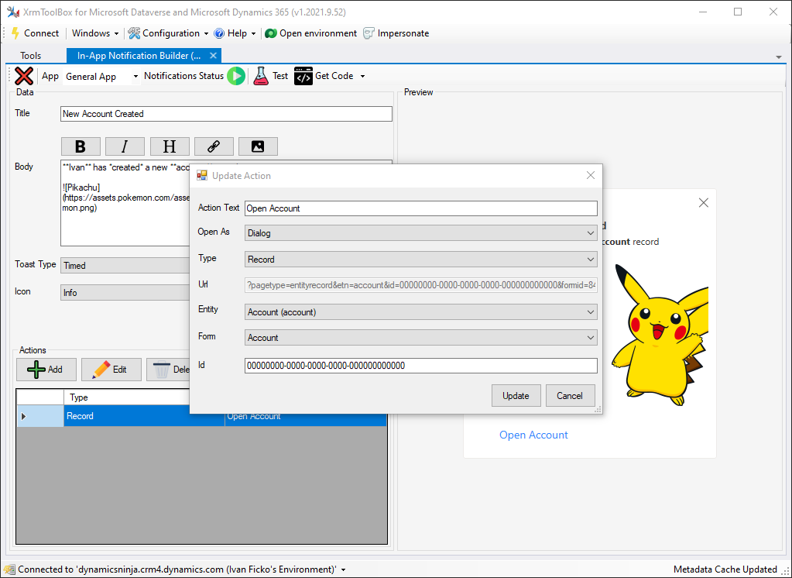
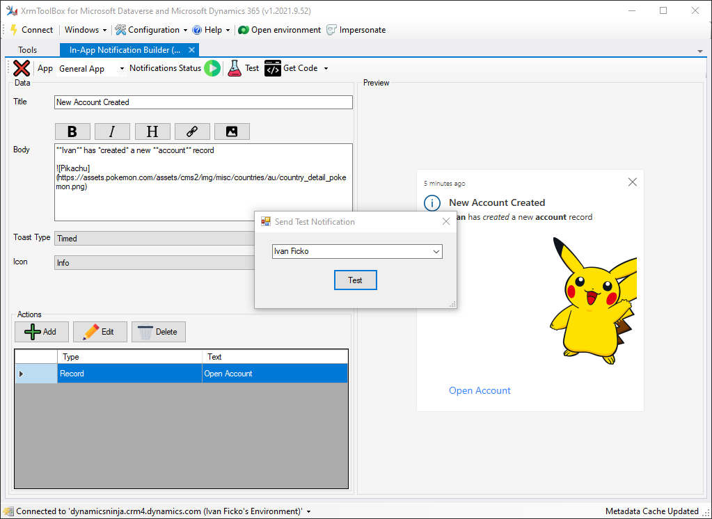
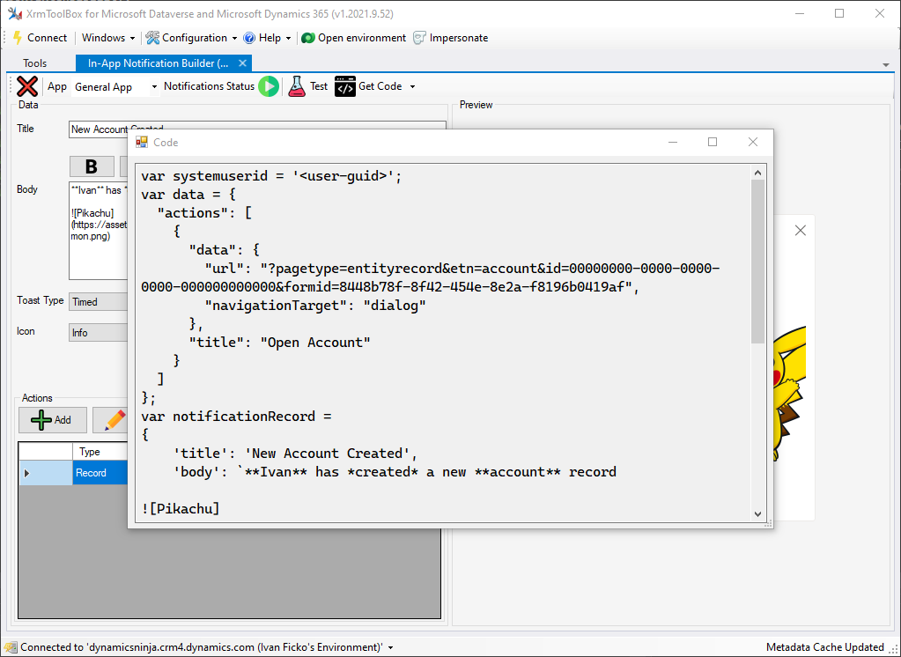

# In-App Notification Builder for [XrmToolBox](http://www.xrmtoolbox.com)

 

XrmToolBox tool that allows you to design your in-app notifications, get live preview and source code for creating.

## Preview

## Features

### Enabling/Disabling Notifications For App

Notifications are still in preview so you need to enable them first and that is super easy. Just pick the app you want, click on the red icon right to it and notifications will be enabled in no time.

### Adding/Editing Actions

You are able to create, update and delete actions via simple interface that will change depending on the type.

Currently it supports 4 types

- URL
- Record
- List
- Custom Page
- Dashboard

### Sending Test Notification

You can send out notification to a user with one click.

### Generate C#/JS Code

After you have designed the notification you can generate C# or JS code that can be used as is directly.

